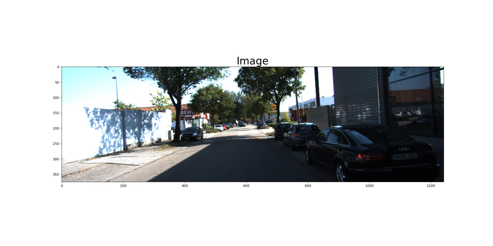
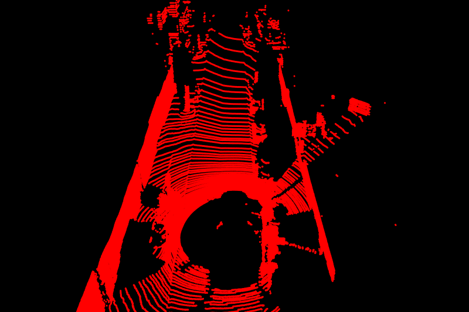
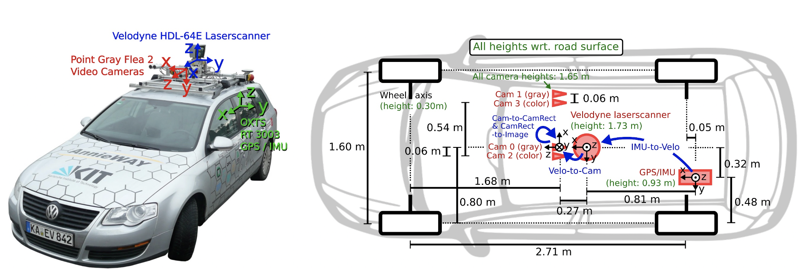
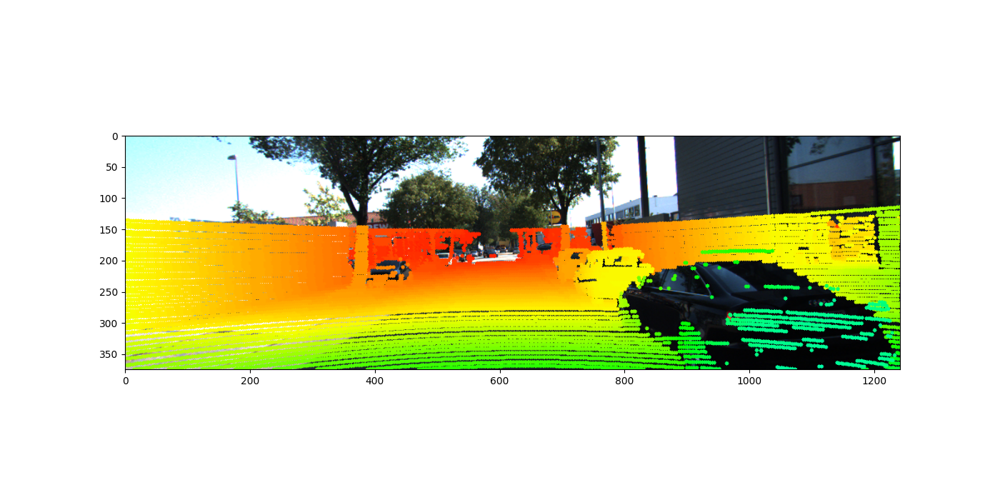
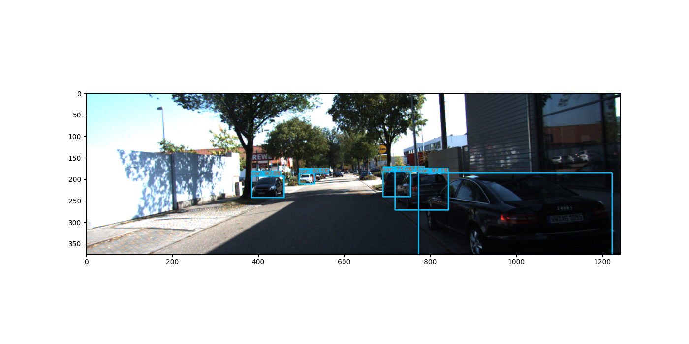
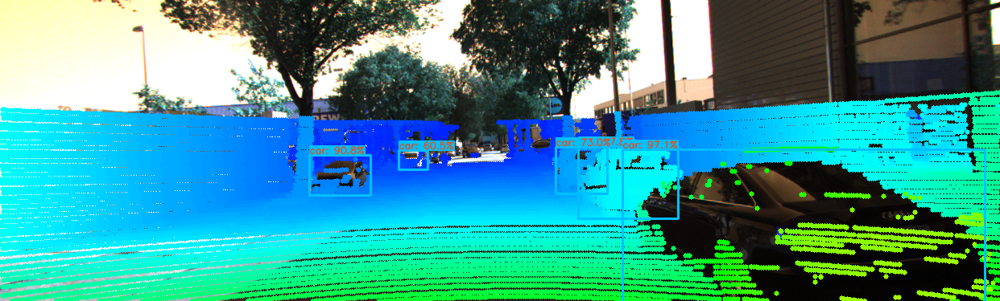
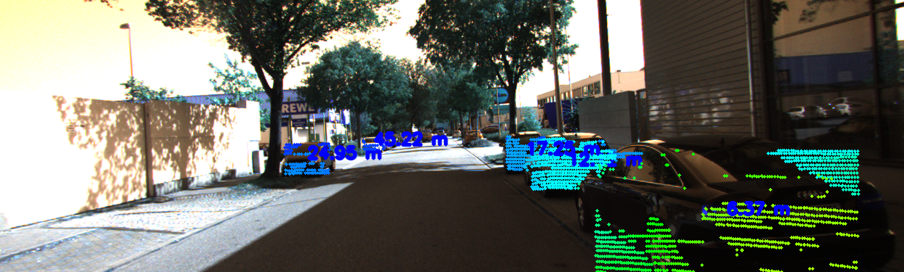

# Early Sensor Fusion for Vision
This project demonstrates the fusion of camera and LiDAR data using the early sensor fusion technique. Early fusion involves combining raw data from multiple sensors before processing. In this project, we utilize the KITTI dataset to fuse image and LiDAR data from specific scenarios. Subsequently, an object detection algorithm is applied to the fused data, resulting in the detection of objects and their distances. The final output can be seen in the following GIF:

## About the Dataset
For this project, we use the KITTI dataset. You can find more information about the dataset by visiting this [link](https://github.com/kuixu/kitti_object_vis).

## Early Fusion
The raw image and point cloud data are as follows:

Image Data from camera

Point Cloud Data from LiDAR

Analyzing the KITTI dataset environment provides information about the sensor positions:

We employ the following formula to project Lidar points (in 3D) onto images (2D):
Y(2D) = P * R0 * R|t * X(3D)
Where:
- P is the Camera intrinsic calibration matrix
- R0 is the Stereo rectification matrix
- R|t is the Lidar to camera rotation/translation matrix
- X is Lidar points in 3D
- Y is Camera points in 2D

The formula is implemented in the `lidar_to_camera_projection` script, producing the following output:

## Object Detection
Utilizing Yolo, we can detect objects within the image. Running the `object_detection_2d` script yields the following result:

## Final Output
After detecting objects, we can filter point clouds associated with these objects by passing their bounding box coordinates to the early-fused data. While some outliers may be present, outlier removal techniques can be applied to remove unwanted points and calculate the distance to these detected objects. Running the `fuse_point_clouds_with_bboxes` script results in the following output:

The `video_writing` script can be used to create the final output as depicted in the GIF above.

### Credits
This project was inspired by and guided by Jeremy Cohen's course at Think Autonomous.
